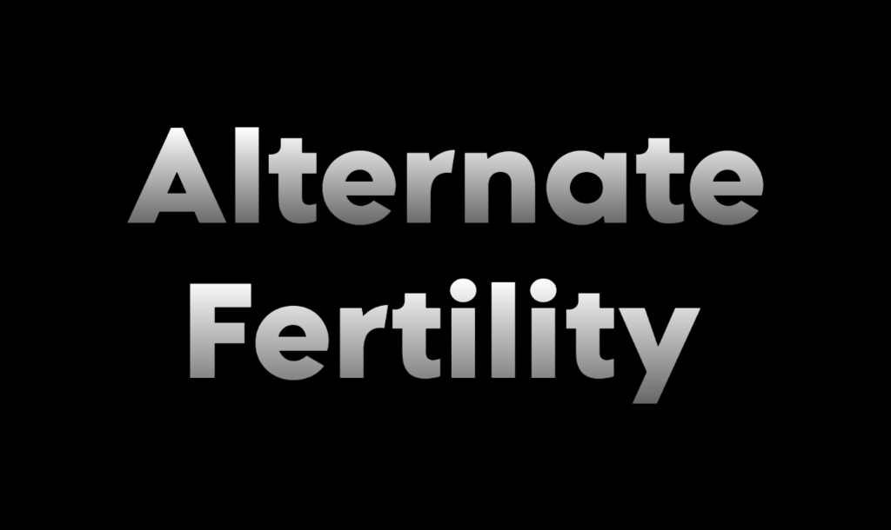

# 

Provides a selection of new fertility genes for your pawns!

**Commissioned in the RimWorld Mod Market**

## Features

Adds a selection of new genes to the game:

- Gynodite: Carriers of this gene are capable of being impregnated by others.
- Androdite: Carriers of this gene are capable of impregnating others.
- Hermaphrodite: Carriers of this gene are capable of impregnating and being impregnated by others.
- Potendite: Carriers of this gene cannot be impregnated, but can impregnate anyone, even those who normally cannot get pregnant.
- Recepdite: Carriers of this gene cannot impregnate others, but can be impregnated by anyone, even those who normally cannot impregnate.
- Reflectite: Carriers of this gene cannot be impregnated, but can only impregnate those who could normally impregnate others.
- Solicite: Carriers of this gene cannot impregnate others, but can only be impregnated by those who could normally be impregnated.

## Compatibility

- XML Extensions: adds a settings menu to toggle genes in pawn generation.

## Existing Saves

This mod should be safe to add to saves.

## Attributions

- Mod title image generated at [Text Studio](https://www.textstudio.com/)
- Gene icons and mod icon from [Flaticon](https://www.flaticon.com/packs/gender-identity-36)
- XML Extensions settings from Tyrant on Steam.

## Bugs and Requests

Let me know if there are any bugs or requests, I'll happily do my best to fix them up!

Open to contributions and suggestions!
